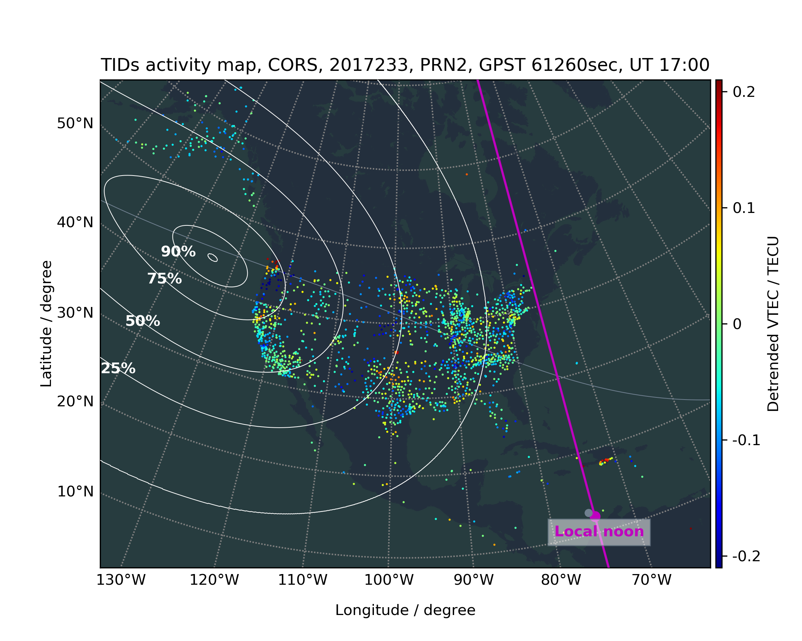
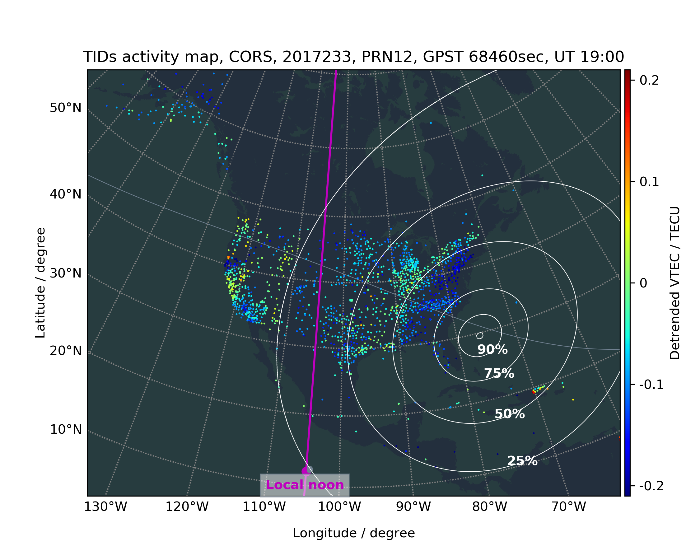
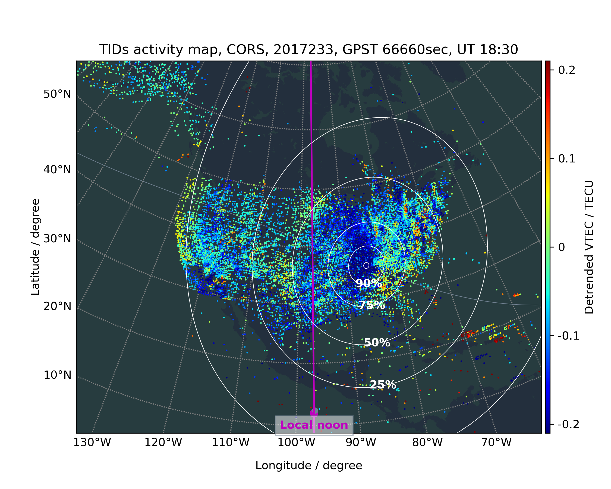
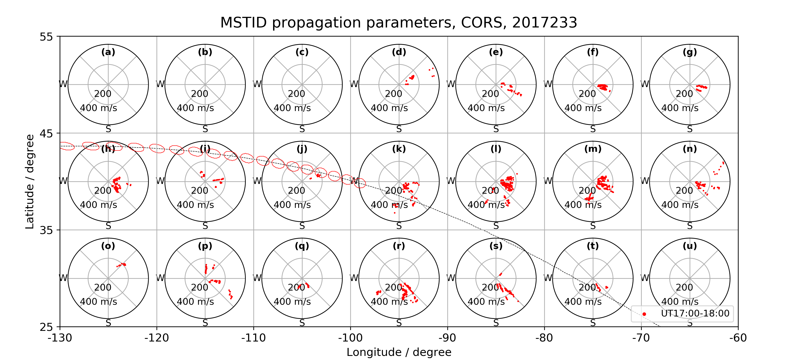
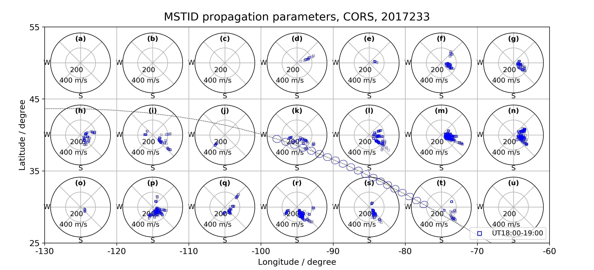
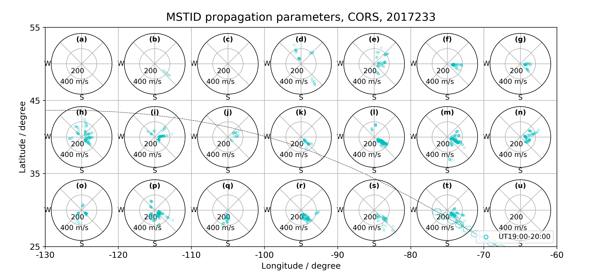
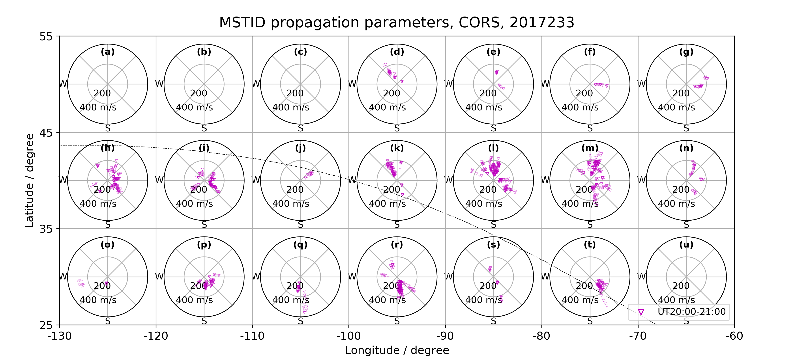
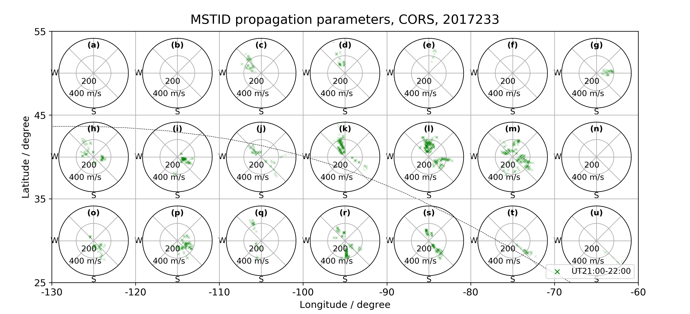

# Detection and description of the different ionospheric disturbances that appeared during the solar eclipse of 21 August 2017

## Ionospheric disturbance movie during 15:00-22:00 UT, from CORS GNSS network, 2017233

### The detrended VTEC map, GPS satellite PRN 2.

### The detrended VTEC map, GPS satellite PRN 12.

### The detrended VTEC map, all GPS satellites.

## Azimuth vs. Velocity Polarplots of Medium Scale TIDs characterisitics, from CORS GNSS network, 2017233, all GPS satellites.

### 17:00-18:00 UT

### 18:00-19:00 UT

### 19:00-20:00 UT

### 20:00-21:00 UT

### 21:00-22:00 UT

